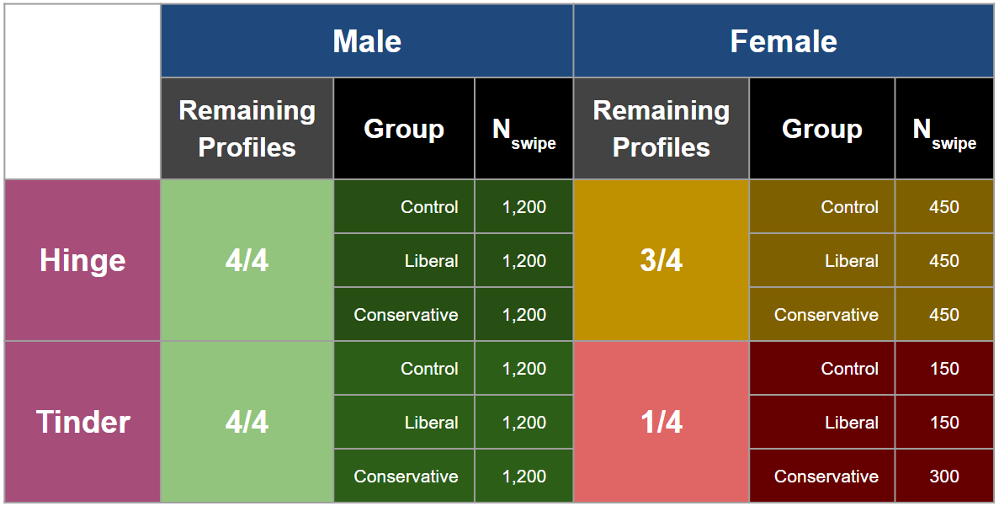

```{r setup, include=FALSE}
knitr::opts_chunk$set(echo = TRUE)

library(data.table)
library(dplyr)
library(ggplot2)
library(magrittr)
library(lmtest)
library(sandwich)
library(knitr)
library(patchwork)
library(stargazer)
library(tidyr)
library(gridExtra)
library(kableExtra)
```

# Abstract

_Does identifying as a conservative vs. a liberal vs. not identifying lead to a difference in the number of matches and responses on a dating profile?_ Today’s political climate is running hot with the increasing polarity between conservatives and liberals. This study set out to answer whether this political divide really does carry itself into dating decision-making by observing the effect of adding a political leaning in a profile's biography on the profile's match rate. Similar young adult, Caucasian dating profiles were created on the Hinge and Tinder dating application platforms, and the political leaning of their profile bios were varied between no-leaning, liberal-leaning, and conservative-leaning personal statements over a period of four weeks. The profiles were exposed to users in the city of Houston, Texas. The experiment found that women on Hinge experience a -23 to -10 point lower nominal match rate by including a conservative-leaning statement in their profile bio than if they had not included it. The effects of liberal treatments, or conservative treatments on other genders and platforms, were inconclusive.

# Background

## Theory:
A person’s political leaning has been a polarizing characteristic because opinions differ but are often supported by strong convictions or emotions. The discussion of those views, face-to-face or in the online space, can lead to strengthened relationships or explosive disagreements. Studies have found that people generally prefer to surround themselves with politically like-minded individuals, dating applications being no exception [(Huber and Malholtra, 2016)](https://www.journals.uchicago.edu/doi/pdf/10.1086/687533)\footnote{Huber and Malholtra, 2016 "Political Homophily in Social Relationships: Evidence from Online Dating Behavior", The Journal of Politics 2017 79:1, 269-283 https://www.journals.uchicago.edu/doi/pdf/10.1086/687533}. One study was conducted in 2019 to measure via survey the relative attractiveness of fabricated mock dating profiles, which found that profiles mentioning a political leaning in the description tended to score a lower attractiveness rating compared to profiles that did not mention a political leaning [(Matthew Easton, 2019)](https://scholarsarchive.byu.edu/cgi/viewcontent.cgi?article=1236&context=sigma) \footnote{Easton, Matthew (2019) "The Democracy of Dating: A Survey Experiment on American Dating Preferences," Sigma: Journal of Political and International Studies: Vol. 36}. When applying this to real dating applications, it is possible that disclosing the political leaning in a person’s profile can attract like-minded individuals (usually of similar political leaning) to match with the person and deter those that differ in opinion.  

## Concept Under Investigation:
Our study is focused on measuring the effect of disclosing a person’s political leaning in a dating application on the likelihood of obtaining a match with a profile and the likelihood of receiving a message from a matched profile.  

[Huber and Malholtra, 2016](https://www.journals.uchicago.edu/doi/pdf/10.1086/687533) performed two studies, one randomized controlled and one observational. Both found that political homophily is associated with an increase in dating interest and conversational engagement.  

The first study is a large-scale survey study of 1,000 subjects. 10 randomly constructed opposite-sex dating profiles, with political classifications randomly assigned, are provided for evaluation. The subjects evaluate their interests in the person on a 5-point scale. Results found that as homophily increased, interest in initiating contact, willingness to respond, interest in long-term dating, and desire for friendship all increased at statistically significant levels.  

The second study is an observational study of data from a major dating website, measuring over 100,000 women’s and 100,000 men’s interaction behaviors on the app. The study had data on the subjects’ political views as well as additional demographics such as age and geography. The study focused mostly on heterosexual men performing the first outreach and heterosexual women’s responses, as this is the dynamic occurring most frequently in the real world. Results found that men message women with political homophily more often than others. Furthermore, women reinforced this by responding more to men with more similar political views to their own. Both of these studies suggest that our experiment will find similar results–namely, that men and women with political homophily will match and respond to each other more often than those without political homophily.


# Research Question
The research question tackled by this study is _Does including one’s political leaning in a dating application biography affect the number of matches?_ This study ran a collection of similar, young Caucasian adult, dating profiles across two large dating apps in the city Houston, Texas: Tinder, and Hinge. The Houston area was chosen because it is a large metropolitan market measured to have a very similar proportion of Liberal and Conservative voters in the 2020 presidential elections.

## Reason About Mechanisms

The experiment attempted to isolate the use of a political statement from other covariates in a dating application. The study was limited to dating application platforms with broad appeal across different demographics, abide by the paradigm of swipe-and-match, and have a free exchange of messages. The profiles reflected that of heterosexual CIS persons between 24 and 32 years of age. Each profile contained nearly identical biography copy, except for the treatment content in the form of an additional political leaning indication. The profile pictures were sourced from visually similar contacts in our network, and mild adjustments were applied to provided photos for privacy purposes (due to the likenesses being associated with political statements). These methods were applied to reduce the effect variance in both nominal attractiveness in the used photos and the likelihood of attracting a match to isolate the effect of the political statements as much as possible.

# Hypothesis
The null hypothesis is that adding a political leaning to the dating profile biography will have zero treatment effect on the match rate of the profile.  

The effect on match rate is measured as the delta match rate during a period of treatment relative to match rate during a period without treatment. The null hypothesis is that the match rate of a profile with a liberal or conservative leaning in the biography will not have a different match rate than that of no political leaning in the biography for any given week.  

The alternative hypothesis, based on findings of the related literature, is that a biography that does not show a political leaning will generate higher match rates than either Liberal or Conservative treatments. Between the two treatments, the alternative hypothesis is that Liberal treatments will generate slightly higher match rates than Conservative treatments.

# Measurement Units

The measurement unit or outcome to answer the research question is the **match rate**. This is defined as the number of matches a profile received divided by the number of likes (or right swipes) that the profile gave out. The total number of likes and matches are measured at the end of every treatment week.

$$\mathit{Match\;Rate} = \frac{\mathit{Total\;Matches\;Received}}{\mathit{Total\;Likes\;Given}}$$

This study measured matches from the users on the dating application platforms who our profiles were exposed to by the algorithm. The profiles were exposed to all users on the platform located in the city of Houston, Texas within 50 miles of the city center.


# Methodology

## Experimental Design

A 2 x 2 x 3 Within-Subjects experiment was conducted involving two genders, across two dating application platforms, with three treatment variants all deployed in the city of Houston, Texas. Since different dating profiles garner varying numbers of matches (due to people's preferences and personality types), this experimental design was used in order to treat all the profiles with all the treatment variants (no political leaning, liberal statement, conservative statement) over a four-week period. Sixteen profiles were created, all portrayed young Caucasian adults between 24 to 32 years of age, across two platforms (Hinge and Tinder). All profiles were enrolled in a premium subscription to expand the number of likes, matches, and data that the profiles can access. The profiles were split by gender and platform. Among Tinder platforms, four profiles were male and four profiles were female; while on Hinge, four profiles were male and four profiles were female.

All profiles followed a shuffled treatment schedule after the first week so that the treatment variants had equal representation each week. Table \ref{tab:design} shows the schedule of treatments during the experiment.


```{r design, include=TRUE, echo = FALSE}

asignment <- c('Person 1 Tinder','Person 1 Hinge','Person 2 Tinder','Person 2 Hinge',
               'Person 3 Tinder','Person 3 Hinge','Person 4 Tinder','Person 4 Hinge',
               'Person 5 Tinder','Person 5 Hinge','Person 6 Tinder','Person 6 Hinge',
               'Person 7 Tinder','Person 7 Hinge','Person 8 Tinder','Person 8 Hinge' )

week_0 <- rep(c('Control'), 16)
week_1<- c( 'Control','Liberal','Liberal','Conservative','Control','Liberal','Conservative',
            'Conservative','Control','Liberal','Liberal','Conservative','Conservative',
            'Control','Conservative','Control'  )
week_2<- c('Liberal','Conservative','Control','Liberal','Conservative','Control','Liberal',
           'Control','Conservative','Conservative','Control','Liberal','Liberal','Liberal',
           'Control','Conservative' )
week_3<-c( 'Conservative','Control' ,'Conservative','Control','Liberal','Conservative',
           'Control','Liberal','Liberal','Control','Conservative','Control','Control',
           'Conservative','Liberal','Liberal' )

  
summary_table <- data.table(
  'Profile'= asignment, 
  'Week 0' = week_0, 
  'Week 1' = week_1, 
  'Week 2 '= week_2,
  'Week 3' = week_3
)

summary_table%>%
  kbl(caption="Summary Table, Experimental Design", format = "latex", booktabs = T,linesep = "",
      col.names = c("Profile","Week 0","Week 1", "Week 2", "Week 3"))%>%
      kable_classic(full_width = F,  html_font = "Source Sans Pro") %>%
      kableExtra::kable_styling(latex_options = "hold_position")
```


Three times a week, each profile would follow the same randomized swiping pattern determined by a random order-generating script. The randomized pattern would guarantee a 14 percent like-rate for female profiles, and 46 percent like-rate for male profiles, to simulate the frequency of the like-rate of normal users. No messages were sent or initiated to the users who liked or matched with the profiles.  

For the first week all profiles were run without treatment to remove any bias caused by the initial surge of exposure when the profiles were created. The first week was also used the set a baseline expected match rate for each profile (to capture natural desirability variance between profiles).

At the end of every week, the profiles were paused on all platforms, the number of matches and likes were recorded, and the next treatment was added. Before re-exposing the profile with the treatment, the day of pausing was also designated to remove exposure to user who have seen the profile so that the succeeding matches would most likely have been due to seeing the updated profile.

## Logistical Considerations

Dating application platforms have become increasingly robust at detecting and shadow-banning (quietly removing from public display without notifying the user) accounts. This scenario presents potentially fatal consequences to the experiment so the following measures have been taken to avoid:

* Unique phone numbers across multiple accounts (a Tinder and Hinge account sharing the same name and likeness shared the same phone number)
* All IP addresses used to access accounts were unique across multiple accounts
* Each pair of name and likeness was shared by at most two accounts (one on Tinder and one on Hinge)
* All accounts swiped at a similar rate where for women 14 percent of swipes liked profiles while 86 percent of swipes ignored or disliked profiles to avoid excessive swiping, or suspiciously high "like" rates. The same process was carried out for men, liking 46 percent of the profiles, and ignoring 54 percent. 
* Male profiles registered more like swipes to emulate the trend that male users tend to swipe more  than females to find a match
* All profiles have slightly different variations of the control and treatment biography statements to avoid exact replicas that could raise suspicion of fake accounts while maintaining the same essence of the control and treatment statements
* Different payments methods were used to pay for the premium subscriptions
* All profiles either set their location in Houston, Texas (Hinge) or used the Tinder Travel service to place their locations in Houston

Given the countermeasures to protect the accounts, the following measures have been conducted to balance the data as much as possible

* Swiping was done at regular intervals during the week with a randomized pattern that was uniformly followed by all profiles
* All profiles were enrolled in a premium subscription to maximize the number of likes that can be given and to easily record the number of likes and matches received
* A randomized shuffled treatment schedule after Week 1 gave a distributed treatment exposure

## Treatment Variants

The users of the dating application platforms were subjected to three different treatment variants throughout the experiment. The control group for a particular week was exposed to dating application profiles with a biography without a political leaning. One treatment group for a particular week was exposed to dating application profiles with a Democratic-leaning indication in its biography while the other treatment group was exposed to dating profiles with a Republican-leaning indication in the biography.  

All profile bios will begin with roughly identical description that contained the following elements: **Love for food, travel, and good times; looking for an adventure**.  

Treatment profiles included a politically biased copy of a statement that varied between a liberal and conservative view. Table \ref{tab:treatment}  shows a list of the statements used for each treatment.


```{r treatment, include=TRUE, echo = FALSE}

topic <- c('Political Leaning','Abortion','Black Lives Matter (BLM)','2024 Elections' )
Liberal_Statement <-c('Liberal', 'Pro-Choice','Support BLM','Biden 2024')
Conservative_Statement<- c( 'Conservative','Pro-Life','All Lives Matter','Trump 2024' )

summary_table <- data.table(
  'Topic'= topic, 
  'Liberal Statement' = Liberal_Statement, 
  'Conservative Statement' = Conservative_Statement
)

summary_table%>%
  kbl(caption="Summary Table, Treatment Specifications", format = "latex", booktabs = T,linesep = "",
      col.names = c("Topic","Liberal Statement","Conservative Statement"))%>%
      kable_classic(full_width = F,  html_font = "Source Sans Pro") %>%
      kableExtra::kable_styling(latex_options = "hold_position")
```

## Construction of Profiles

All profiles and likenesses resembled young Caucasian adults within the range of 24 to 32 years of age. All profiles contained six unique images that portray the likeness in different situations, like a typical dating profile. Hometown, school, and other location-related information were set to revolve around the central Houston area.  

The radius of the profiles to be prioritized in the feed was set to 50 miles. Information about drinking, drugs, religion, job, politics, and other polarizing areas was hidden from the public view; only the profile's biography would contain the political leaning. Tinder profiles had a singular biography where the treatment variant was placed and varied. Hinge profiles were required to use three question-and-answer prompts, so the top prompt contained the treatment variant, while the other two prompts were used to portray the uniform personality of all profiles. We enrolled all the profiles in a premium subscription to maximize the number of likes and matches and to allow the profile to view such data. The premium subscription allowed Tinder profiles to set their location in a custom area. Email notifications were turned on to track every single match or like the profile received; however, this feature did not function correctly throughout the experiment.

## Randomization Strategy

The experiment profiles were exposed and shown to users based on the patterns of the platform's algorithm with the distance filter set to 50 miles and the preference filters to be as neutral as possible. We used an R script to create a swipe pattern where male profiles would attempt to match 46 percent of the profiles shown, while female profiles would attempt to match 14 percent. Figure \ref{fig:rand} is a visualization of the randomized sequence of swipes. Green boxes indicate a like/right swipe, while red boxes indicate a skip/left swipe:

```{r rand, fig.show='hold',fig.align='center',out.width="49%", out.height="40%", echo=FALSE, fig.cap="Randomization strategy for male and female profiles"}
knitr::include_graphics(c("images/randomization_male.PNG","images/randomization_female.PNG"))
```

## Pre-Experiment Power Calculation

Based on the pre-experiment assumptions and power calculations (guided by the perceived effects of political leaning on a profile's attractiveness by the [Democracy of Dating by Matthew Easton](https://scholarsarchive.byu.edu/cgi/viewcontent.cgi?article=1236&context=sigma)), Liberal profiles are assumed to be 6.98 percent less attractive than profiles with no political leaning while Conservative profiles are assumed to be 21.12% less than profiles with no political leaning.

We ran a power analyses for men and women. We assumed a five percent match rate for men and 19 percent for women. Figure \ref{fig:power} shows the estimated power as function of the number of swipes for each profile. The results indicated that the liberal profiles for male and female at 15 thousand swipes, had less than 50 percent power to detect an effect of disclosing political leanings in the profile. In contrast, the profiles for conservatives male and female only required 12,500 and 4,000 swipes respectively. To increase power within a reasonable number of swipes achievable with the available resources, we made the treatment more intense by selecting highly polarizing words in the dating profile.


```{r power, out.width = "400px", fig.align="center", echo = FALSE, fig.cap="Simulated statistical power of the experiment"}
knitr::include_graphics(c("images/000058.png"))
#knitr::include_graphics(c("images/power_calculation_estimate.png"))
```

# Results

## Attrition

Each profile carefully mimicked real user behavior to avoid being flagged as suspicious. Unfortunately, despite these efforts, four profiles were banned from the platforms, and only one female profile on Tinder remained at the end of the experiment. This issue had considerable implications for the results of the experiment. In total, 9,150 "like" swipes were administered during weeks 1-3, roughly evenly distributed between each treatment group and control.

```{r atri, out.width = "400px", fig.align="center", echo = FALSE, fig.cap = 'Number of remaining profile sat the end of the experiment and number of swipes'}

```

Out of the four female Hinge profiles, one profile failed to launch due to platform issues. All four male profiles on Tinder and all four male profiles on Hinge were able to fully generate their swipe data. Figure \ref{fig:atri} shows the summary of the data for the remaining profiles at the end of the experiment and the number of swipes.

## Collected Data

Our data file contains a row for every (profile,platform,week) tuple. Each row includes metadata about the gender and platform of the profile, the treatment applied for that given week, the number of swipes we performed on each of the collection days for that week, and the final number of matches tallied at the end of the week.

```{r, include=FALSE}
d_raw <- fread('../Data/swipe-data.csv') %>%
  rename(
    match_rate = Match_Rate,
    profile = Profile,
    gender = Gender,
    platform = Platform,
    week = Exp_Week,
    treatment = Treatment,
    day_0_swipe_count = Day_0_Swipes,
    day_3_swipe_count = Day_3_Swipes,
    day_5_swipe_count = Day_5_Swipes,
    match_count = Match_Count,
    
  ) %>%
  mutate(
    swipe_count = day_0_swipe_count + day_3_swipe_count + day_5_swipe_count,
    match_rate = match_count / swipe_count
  ) %>%
  select(
    profile,
    gender,
    platform,week,
    treatment,
    swipe_count,
    match_count,
    match_rate
  )
```

To control for intrinsic variation within each of our profiles, we attempted to calculate the desirability for each profile based on performance of each during the pretreatment period (week 0). We calculate this as the difference of the profile's match rate from the average match rate of all profiles of the same gender on the same platform, then divided by the same average. Table \ref{tab:desire} shows the desirability for each profile. 

```{r}
pretreatment_values <- d_raw[week == 0,.(
    profile,
    platform,
    gender,
    match_count,
    match_rate
  )] %>%
  rename(
    base_match_count = match_count,
    base_match_rate = match_rate
  )

# calculate profile desirability (how well a profile performed against like profiles
#in the pretreatment period)
pretreatment_values[,avg_group_match_rate:=mean(base_match_rate,na.rm=TRUE),
                    by=.(gender,platform)]
pretreatment_values[,profile_desirability:=(base_match_rate - 
                                          avg_group_match_rate)/avg_group_match_rate]

```

```{r desire, include=TRUE, echo = FALSE}
# display table
pretreatment_values[is.na(profile_desirability)==FALSE,.(profile,platform,profile_desirability)][order(profile,platform),]%>%
  kbl(caption="Summary Table, Profile Desirability", format = "latex", booktabs = T,
      col.names = c("Profile","Platform", "Profile Desirability"),)%>%
      kable_classic(full_width = F,  html_font = "Source Sans Pro")%>%
      kableExtra::kable_styling(latex_options = "hold_position")
```

We then de-aggregate our data so that each swipe is represented in one row, and whether or not that swipe resulted in a match. We also define a "cluster_id" for later calculating clustered standard errors. Table \ref{tab:cluster} shows these clusters.

```{r}
#add pretreatment data to actual experiment data values 
#(filter profiles that did not complete treatment due to bans)
d_week_all <- pretreatment_values[!is.na(base_match_count) & !is.na(base_match_rate),] %>%
              merge(d_raw[week > 0,])

# remove rows that could not be completed due to bans
d_week <- d_week_all[!is.na(match_count) & !is.na(match_rate),]

# pivot counts by profile by week into one row per swipe
d_swipe <- d_week[data.table(swipe_idx=1:d_week[,max(swipe_count)]),
           on=.(swipe_count>=swipe_idx),.
           (profile,platform,gender,profile_desirability,week,treatment,match_count,swipe_idx)]
d_swipe[,matched:=as.integer(swipe_idx<=match_count)]
d_swipe[,cluster_id:=paste(profile,platform,week,sep='-')]

d_swipe[,c("match_count","swipe_idx"):=NULL]

# set omitted variables
d_swipe <- within(d_swipe, treatment <- relevel(as.factor(treatment), ref = "CONTROL"))
d_swipe <- within(d_swipe, gender <- relevel(as.factor(gender), ref = "MALE"))
d_swipe <- within(d_swipe, platform <- relevel(as.factor(platform), ref = "HINGE"))


```

```{r cluster, include=TRUE, echo = FALSE}
set.seed(60)
d_swipe[sample(nrow(d_swipe), 10), ]%>%
  kbl(caption="Summary Table, Clustered data", format = "latex", booktabs = T,
      col.names = c("Profile","Platform","Gender", "Profile Desirability", "Week","treatment","matched","cluster id"),)%>%
      kable_classic(full_width = F,  html_font = "Source Sans Pro") %>%
      kableExtra::kable_styling(latex_options = "hold_position")
```

Table \ref{tab:samples} shows the number of samples we collected for each vector of our 2x2x3 experiment:

```{r samples, include=TRUE, echo = FALSE}
d_swipe[,sum(.N),by=.(gender,platform,treatment)][order(gender,platform,treatment),]%>%
  kbl(caption="Summary Table, Number of Samples", format = "latex", booktabs = T,
      col.names = c("Gender","Platform","Treatment","Samples"))%>%
      kable_classic(full_width = F,  html_font = "Source Sans Pro") %>%
      kableExtra::kable_styling(latex_options = "hold_position")
```
## Models

We explored four models in total:

### Naive Model
Our first model simply regresses the treatment on the expected value of a match.
$$\mathit{Matched} = \mathit{I}(\mathit{CONSERVATIVE}) + \mathit{I}(\mathit{LIBERAL}) + C$$
$$\mathit{Matched} = \mathit{factor}(\mathit{Treatment}) + C$$

```{r}
naive_model <- lm(
  matched ~ factor(treatment)
,data=d_swipe)
```

### Segmented Model

Our second model adds the segments of our 2x3x3 experiment to the naive model to capture natural variance in match rate due to these factors:
$$\mathit{Matched} = \mathit{I}(\mathit{CONSERVATIVE}) + \mathit{I}(\mathit{LIBERAL}) + \mathit{I}(\mathit{FEMALE}) + \mathit{I}(\mathit{TINDER}) + C$$
$$\mathit{Matched} = \mathit{factor}(\mathit{Treatment}) + \mathit{factor}(\mathit{Gender}) + \mathit{factor}(\mathit{Platform}) + C$$

```{r}
segmented_model <- lm(
  matched ~ factor(gender) + factor(platform) + factor(treatment)
,data=d_swipe)
```


### Segmented Model with Controls
Our third model adds our profile desirability control to the segmented model, along with the week of the experiment that the data was collected in order to capture any natural time decay in match rate which may be present.
$$\mathit{Matched} = \mathit{I}(\mathit{CONSERVATIVE}) + \mathit{I}(\mathit{LIBERAL}) + \mathit{I}(\mathit{FEMALE}) + \mathit{I}(\mathit{TINDER}) + \mathit{Profile\;Desirability} + \mathit{week} + C$$
$$\mathit{Matched} = \mathit{factor}(\mathit{Treatment}) + \mathit{factor}(\mathit{Gender}) + \mathit{factor}(\mathit{Platform}) + \mathit{Profile\;Desirability} + \mathit{week} + C$$

```{r}
controlled_segmented_model <- lm(
  matched ~ factor(gender) + factor(platform) + factor(treatment) + week + profile_desirability
,data=d_swipe)
```

### Segmented Model with Interactions and Controls
Our fourth and final model adds interactions between our segments, treatments, and controls to find heterogeneous effects on our controls as well as our treatments.
$$\mathit{Matched} = \mathit{factor}(\mathit{Gender})*\mathit{factor}(\mathit{Platform})*\mathit{factor}(\mathit{Treatment})$$
$$+ \mathit{week}*\mathit{factor}(\mathit{Platform})*\mathit{factor}(\mathit{Gender}) + \mathit{Profile\;Desirability} + C$$


```{r}
interacted_controlled_segmented_model <- lm(
  matched ~ factor(gender)*factor(platform)*factor(treatment) +
            week*factor(platform)*factor(gender) + profile_desirability
,data=d_swipe)
```


## Analysis

For our analysis we used clustered standard errors, clustering on the profile on a specific platform during one treatment week (each cluster maps back to the single row in our raw data set that the de-aggregated row originated from). Table \ref{tab:regression1} shows the results of all the models. 

```{r,results='asis',include=TRUE, echo=FALSE}
naive_model_coeftest <- coeftest(naive_model,vcov=vcovCL,cluster=~cluster_id)
segmented_model_coeftest <- coeftest(segmented_model,vcov=vcovCL,cluster=~cluster_id)
controlled_segmented_model_coeftest <- coeftest(controlled_segmented_model,vcov=vcovCL,cluster=~cluster_id)
interacted_controlled_segmented_model_coeftest <- coeftest(interacted_controlled_segmented_model,vcov=vcovCL,cluster=~cluster_id)

# workaround for stargazer bug with long variable named models
m1 <- naive_model
m2 <- segmented_model
m3 <- controlled_segmented_model
m4 <- interacted_controlled_segmented_model

sg_coef_order <- c(
    "factor\\(treatment\\)CONSERVATIVE",
    "factor\\(treatment\\)LIBERAL",
    "factor\\(gender\\)FEMALE:factor\\(treatment\\)LIBERAL",
    "factor\\(gender\\)FEMALE:factor\\(treatment\\)CONSERVATIVE",
    "factor\\(platform\\)TINDER:factor\\(treatment\\)LIBERAL",
    "factor\\(platform\\)TINDER:factor\\(treatment\\)CONSERVATIVE",
    "factor\\(gender\\)FEMALE:factor\\(platform\\)TINDER:factor\\(treatment\\)LIBERAL",
    "factor\\(gender\\)FEMALE:factor\\(platform\\)TINDER:factor\\(treatment\\)CONSERVATIVE",
    "factor\\(gender\\)FEMALE",
    "factor\\(platform\\)TINDER",
    "factor\\(gender\\)FEMALE:factor\\(platform\\)TINDER",
    "profile_desirability",
    "week",
    "factor\\(platform\\)TINDER:week",
    "factor\\(gender\\)FEMALE:week",
    "factor\\(gender\\)FEMALE:factor\\(platform\\)TINDER:week",
    "Constant"
  )

stargazer(
  m1,
  m2,
  m3,
  m4,
  se = list(
    naive_model_coeftest[,"Std. Error"],
    segmented_model_coeftest[,"Std. Error"],
    controlled_segmented_model_coeftest[,"Std. Error"],
    interacted_controlled_segmented_model_coeftest[,"Std. Error"]
  )
  #,type = "text"
  ,order=paste0("^",sg_coef_order , "$"),
  header=FALSE,
  #column.sep.width = "-10pt",
  #single.row = TRUE,
  no.space = TRUE,
  font.size="scriptsize",
  column.labels = c("Naive", "Segmented","w/Controls","Interacted"),title = "Treatment Effects of Disclosing Political Leanings on Dating Profile",label = "tab:regression1"
  , float.env = "sidewaystable"
)
```

Our naive model predicts no statistically significant effect of either treatment. Our segmented model does not find any statistically significant effect either, although the standard error of our model is reduced from 0.284 to 0.260. It does find that women have a `r round(segmented_model_coeftest["factor(gender)FEMALE",1],3)` $\pm$ `r round(1.96*segmented_model_coeftest["factor(gender)FEMALE",2],3)` higher nominal match rate than men. It also find that profiles on Tinder have a `r round(segmented_model_coeftest["factor(platform)TINDER",1],3)` $\pm$ `r round(1.96*segmented_model_coeftest["factor(platform)TINDER",2],3)` nominal match rate compared to profiles on Hinge. Our model with controls further reduces our model's standard error from 0.260 to 0.258. While there is no dramatic shift in the predicted effects of gender or platform, the model does expose that a profile's desirability for men and women can affect a nominal match rate by up to `r round(controlled_segmented_model_coeftest["profile_desirability",1],3)` $\pm$ `r round(controlled_segmented_model_coeftest["profile_desirability",2],3)`. It also exposes that for each additional week there is a `r round(-1*controlled_segmented_model_coeftest["week",1],3)` $\pm$ `r round(controlled_segmented_model_coeftest["week",2],3)` decrease in nominal match rate.

These first three models assume same political treatment effect for both men and women on both platforms. Our last model exposes the treatment effect to be much more heterogeneous, as well as the different effects the controls have on different platforms and genders. This model containing interactions reduces the standard error from 0.258 to 0.255. With this model it can be seen that there continues to be no statistically significant treatment effect (for any political sentiment) for men on either Hinge or Tinder, and no statistically significant treatment effect for the liberal treatment regardless of gender. However, there is evidence of highly statistically significant effect of a conservative treatment for women on both platforms. Because it is difficult to mathematically determine the net effect of these statistically significant coefficients, it is easiest to "re-level" the model so that female is the omitted variable which transforms these coefficients into something more clearly interpretable. 

```{r}

releveled_model_coeftest <- function(gender_str,platform_str,m_orig) {
  d <- d_swipe[,]
  d <- within(d, gender <- relevel(as.factor(gender), ref = gender_str))
  d <- within(d, platform <- relevel(as.factor(platform), ref = platform_str))
  formula_str <- eval(m_orig$call[[2]])
  m <- lm( formula_str,data=d)
  return(coeftest(m,vcov=vcovCL,cluster=~cluster_id))
}

m5_female_hinge_coeftest <- releveled_model_coeftest("FEMALE","HINGE",
                                                     interacted_controlled_segmented_model)
m5_female_tinder_coeftest <- releveled_model_coeftest("FEMALE","TINDER",
                                                      interacted_controlled_segmented_model)
m5_male_tinder_coeftest <- releveled_model_coeftest("MALE","TINDER",
                                                    interacted_controlled_segmented_model)

```

By re-leveling the model to female on Hinge, the conservative treatment effect for women on Hinge can be observed as a decrease in nominal match rate by `r round(m5_female_hinge_coeftest["factor(treatment)CONSERVATIVE",1],3)` $\pm$ `r round(1.96*m5_female_hinge_coeftest["factor(treatment)CONSERVATIVE",2],3)`, with a p-value of `r m5_female_hinge_coeftest["factor(treatment)CONSERVATIVE",4]`. Using the *Bonferroni* method, we adjusted our threshold p-value to be 0.00625 to offset the multiple observations of our 2x2x3 experiment. The p-value for this conservative treatment is still less than the adjusted threshold and confirms our findings to be statistically significant.

By re-leveling the model to female on Tinder, we can see that while certain interaction variables pertaining to women on Tinder were statistically significant in the original male-Hinge leveled model, they wash out resulting in a statistically insignificant effect of `r round(m5_female_tinder_coeftest["factor(treatment)CONSERVATIVE",1],3)` $\pm$ `r round(1.96*m5_female_tinder_coeftest["factor(treatment)CONSERVATIVE",2],3)`, with a p-value of `r round(m5_female_tinder_coeftest["factor(treatment)CONSERVATIVE",4],3)`.

Our interacted model also captures a more accurate measurement of the different nominal match rate between men and women of `r round(interacted_controlled_segmented_model_coeftest["factor(gender)FEMALE",1],3)` (compared to the earlier reported `r round(segmented_model_coeftest["factor(gender)FEMALE",1],3)`).

The model also exposes how the dating app algorithm has different time decays for different platforms and genders (previously reported uniformly as `r round(segmented_model_coeftest["factor(gender)FEMALE",1],3)`). A female profile on Hinge has a time decay of `r round(m5_female_hinge_coeftest["week",1],3)` per week in nominal match rate v. Tinder where women have a time decay of `r round(m5_female_tinder_coeftest["week",1],3)` per week. Men on Hinge have a time decay of `r round(interacted_controlled_segmented_model_coeftest["week",1],3)` per week in nominal match rate. Male profiles on Tinder do not have any statistically significant time decay. However, this is likely due to the fact that male profiles on Tinder have an expected base nominal match rate of `r round(m5_male_tinder_coeftest["(Intercept)",1],3)`, which does not leave much room for decay.

# Conclusion

## Summary of Findings

Figure 4 is a graphical representation of treatment effect confidence intervals on each segment:

```{r res,  echo=FALSE, fig.cap ='Summary of Confidence Interval of Treatment Effects'}

releveled_ci <- function(gender_str,platform_str,m_orig,d_i) {
  d <- d_i[,]
  d <- within(d, treatment <- relevel(as.factor(treatment), ref = "CONTROL"))
  d <- within(d, gender <- relevel(as.factor(gender), ref = gender_str))
  d <- within(d, platform <- relevel(as.factor(platform), ref = platform_str))
  formula_str <- eval(m_orig$call[[2]])
  m <- lm( formula_str
            ,data=d)
  ci <- coefci(m,vcov=vcovCL,cluster=~cluster_id)
  tb <- data.table(
    gender=c(gender_str,gender_str),
    platform=c(platform_str,platform_str),
    segment=c(paste(gender_str,platform_str,sep=":"),paste(gender_str,platform_str,sep=":")),
    treatment=c("LIBERAL","CONSERVATIVE"),
    ci_min=c(ci["factor(treatment)LIBERAL",1],ci["factor(treatment)CONSERVATIVE",1]),
    ci_max=c(ci["factor(treatment)LIBERAL",2],ci["factor(treatment)CONSERVATIVE",2])
  )
  return(tb)
}

gc <- rbind(
 releveled_ci("MALE","HINGE",m4,d_swipe),
 releveled_ci("FEMALE","HINGE",m4,d_swipe),
 releveled_ci("MALE","TINDER",m4,d_swipe),
 releveled_ci("FEMALE","TINDER",m4,d_swipe)
  
)

nss <- gc[ci_min/abs(ci_min) != ci_max/abs(ci_max),]

ss <- gc[ci_min/abs(ci_min) == ci_max/abs(ci_max),]

brs <- rbind(
  nss %>% mutate(ci=ci_min,cat='bar'),
  nss %>% mutate(ci=ci_max,cat='bar'),
  ss %>% mutate(ci=(ci_max-ci_min)*(abs(ci_max)/ci_max),cat='bar'),
  ss %>% mutate(ci=pmin(abs(ci_min),abs(ci_max))*(abs(ci_max)/ci_max),cat='spacer')
)

g1 <- ggplot(brs[treatment=="LIBERAL"], aes(x = segment, y = ci, fill = cat)) +
  geom_col() +
  geom_hline(yintercept = 0) +
  coord_flip() +
  ylim(-0.25,0.25) +
  scale_x_discrete(limits = c("FEMALE:TINDER","FEMALE:HINGE","MALE:TINDER","MALE:HINGE")) +
  ggtitle("Liberal Treatment Effect") +
  labs(y = "Delta Match Rate", x="Segment") +
  theme(legend.position="none") +
  scale_fill_manual(values=c("#4488FF",
                             alpha("#FFFFFF",0.0)))
  #scale_y_discrete(limits = c(-0.25,0.25))

g2 <- ggplot(brs[treatment=="CONSERVATIVE"], aes(x = segment, y = ci, fill = cat)) +
  geom_col() +
  geom_hline(yintercept = 0) +
  coord_flip() +
  ylim(-0.25,0.25) +
  scale_x_discrete(limits = c("FEMALE:TINDER","FEMALE:HINGE","MALE:TINDER","MALE:HINGE")) +
  ggtitle("Conservative Treatment Effect") +
  labs(y = "Delta Match Rate", x="") +
  theme(legend.position="none",axis.text.y=element_blank(),  #remove y axis labels
        axis.ticks.y=element_blank()) +
  scale_fill_manual(values=c("#DD4444",
                             alpha("#FFFFFF",0.0)))


grid.arrange(
  g1,
  g2,
  nrow = 1,
  top = "Treatment Effects by Segment"
  ,widths=c(5,4)
)


```


The only statistically significant observation pertaining to our political treatments was that of the conservative treatment on female profiles on Hinge, with a confidence interval from `r round(100*(m5_female_hinge_coeftest["factor(treatment)CONSERVATIVE",1]-1.96*m5_female_hinge_coeftest["factor(treatment)CONSERVATIVE",2]),3)` to `r round(100*(m5_female_hinge_coeftest["factor(treatment)CONSERVATIVE",1]+1.96*m5_female_hinge_coeftest["factor(treatment)CONSERVATIVE",2]),3)` points lower nominal match rate.

We did not find any statistically significant treatment effect for male profiles on either platform. This is not unexpected, given the lower match rates for male profiles, especially on Tinder. To better visualize this problem, we assume a male profile, on average, had about a five percent match rate. Therefore, even a treatment that halves a profile's number of matches only decreases its nominal match rate by 2 or 3 points. To achieve a tight enough confidence interval to be statistically significant, we would need far more samples than were within our means. This is also arguably a precision problem. For example, a male profile, on average, gets five matches per 100 swipes. If the average treatment effect (ATE) is a ten percent reduction, their matches would now be 4.5 on average. But we cannot observe 4.5 matches. The closest we can measure is 4 matches. Or 5 matches. In the best-case scenario, many measurements of 4s and 5s would be needed until it converges around 4.5.

We did not find any statistical significance for liberal female profiles on Hinge due to a wide confidence interval. We hypothesize this could be due to divergent effects of different variations of liberal treatments.

We did not find any statistical significance for female Tinder profiles, which is not unexpected given the power lost to profile bans. With only one remaining female Tinder profile, there was only one treatment in circulation for any given week on Tinder. This means there was insufficient information for the regression to capture time decay correctly. Though not statistically significant, the model predicts a positive ATE for conservative treatment and near equal and opposite negative ATE for liberal treatment. In consideration that the single-standing female profile ran the conservative treatment in week 1 and liberal treatment in week 3, we hypothesize this is time decay being misattributed to the treatment variables.

For each gender, confidence intervals for Tinder have a stronger tendency towards zero relative to their Hinge counterparts. We hypothesize this is due to different user audiences. Tinder is known to be a more "casual" app, compared to Hinge where people are seeking meaningful relations. It is likely that a higher percentage of Tinder users like and match users simply from looking at profile pictures vs. reading the biography content where the political treatments resided. It's also possible that because Tinder is more casual, the political preferences of prospects are less of a concern for short-term endeavors. 

## Concerns

Over the course of the experiment, certain concerns have been discovered that may have affected the results, and consequently the study's ability to measure the treatment effects.  

**Unknown Compliance, Spillover, and Bots:** The study was only able to measure intended treatment effect. It was difficult to verify if the user swiped on was shown the experimental profile, or if the user read the profile biography for the treatment versus simply swiping on images unrelated to the treatment. During the data-gathering period, the same experimental profiles were recycled from week to week, and it cannot be certain that a counted swipe was observed before the profile treatment was altered to a subsequent treatment. Also, for male profiles on Tinder, a substantial portion of matches appeared to be bots selling services, which are unlikely to care about biography content.  

**Working Around The Algorithm:** During the data gathering period, it was observed that different profiles experienced a divergence in the type of users of potential matches being presented. It is possible that this is the algorithm's attempt to increase match rates for "unattractive" profiles performing "poorly". Also, it is difficult to determine to what degree the algorithms gave different visibility to different profiles.  

**Participant Overlap:** It was observed that the same user was sometimes presented to more than one of the test profiles. Sometimes, the same user was observed on both platforms. Therefore, the samples are not completely I.I.D.  

**Heterogeneous Treatment Effects Between Profiles:** In dating, certain people have the luxury of being more selective than others due to the varying demand for certain personalities or traits in the community. It is difficult to measure what portion of the nominal match rates were driven by matches with people with low selectivity (people who would choose almost any profile to match), which could have diluted the treatment effect on more selective profiles.  

**Inaccurate Match Counts:** Profiles that matched with then unmatched disappeared from the list of matches of each experimental profile. Email notifications did not function properly, so matches that unmatched in between tallies were lost.  

**Demand, Scarcity, and Ulterior Motives:** The objective was to measure demand for different treatments, but the experiment could also have measured scarcity. A positive treatment effect may not measure that more people are seeking that treatment than not, but simply that the number of people seeking that treatment exceeds those on the platform expressing that treatment, which skews selectivity. For example, a male profile with a liberal-leaning is more scarce than a male profile with a conservative-leaning in a particular area, so more users would be more likely to match with the liberal-leaning profile due to fewer alternatives in the community. Some of the profiles also matched with the experimental profiles, not for the purpose of dating pursuits, but rather to engage in hostile confrontation over the expressed treatment.  


## Future Work

Short of being able to work in partnership with dating application companies to address the litany of discussed concerns, a dating application experiment cannot be endorsed as a viable medium for social experiments.

However, if an attempt must be made, we can make some suggestions to mitigate some of the previously mentioned concerns. First, we recommend at least ten times the number of profiles with ten times the number of collected samples to achieve the necessary statistical power. Second, this experiment was limited to one geographic location with Caucasian young adults. Location, ethnicity, and age should be diverse in future experiments, and the number of collected samples should scale accordingly with the larger target population. Third, the profiles should be operated within proximity of the locations they are engaging with and engage with matches within app messaging so that the algorithm does not flag activity as unusual. Fourth, the age and ethnicity of every person swiped on and every person matched with should be fully documented so that heterogeneous treatment effects can be fully observed. Finally, including political treatment within the profile photos rather than biography text can improve treatment compliance since it will be more likely to be seen.  

## Consort Statement
The trial design involved a 2x2x3 within-subjects experiment, where we created 16 profiles divided equally among 2 genders, across 2 platforms (Tinder and Hinge), with 3 treatment variants.  

The participants for both treatment and control profiles were selected by the dating application platform’s algorithm for users aged in their 20s and 30s within 50 miles of Harris County, Texas (Houston).  

The intervention consisted of varying dating application biographies to include either generic statements (control) or politically-charged conservative and liberal beliefs (treatment).  

The sample size was determined by the algorithm within a set period of 3 weeks of testing. The randomization occurred via applying the same application settings to treatment and control, varying only the treatment itself across time.  

The outcomes were statistically significant for Hinge female conservative profiles, finding that conservative females on Hinge receive fewer matches than control and liberal profiles.  

The experiment primarily experienced challenges around accounts being banned for spam, affecting the power of the results. In addition, the selection of people and changes in the algorithm’s decisions across time was ambiguous to the experimenters, which may have introduced unmeasurable bias.  

The team received a reimbursable $500 credit for running the experiment, which was spent on premium profiles to allow for unlimited app swipes and access to like and match data.
